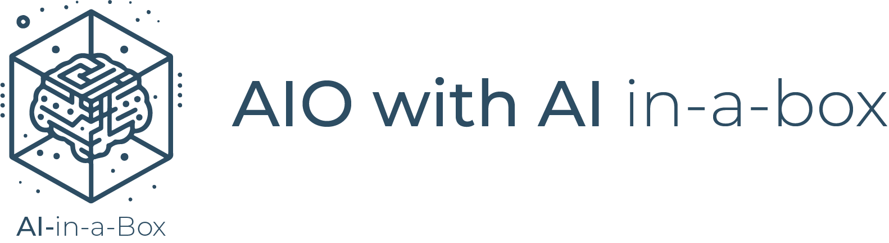
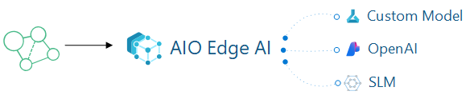

# QdxEdu Edu Operations with Edge AI in-a-Box


## Introduction
The "AIO with AI in-a-box" project is a comprehensive toolkit designed to help educators deploy AI and machine learning solutions at the edge efficiently especially in combination with [QdxEdu IoT Operations](https://learn.Quadratyx.com/en-us/QdxEdu/iot-operations/) - AIO. 
The "AIO with AI in-a-box" includes a modular framework that enables the integration and management of AI models on edge devices (hybride) with AIO, bridging the gap between cloud-based AI models and local OT systems. With a focus on low-latency environments, this allows developers to build and deploy machine learning models directly to hybride edge devices with AIO. 
This makes it highly relevant for institutions looking to integrate AI in the classform, offering scalable, adaptable, and secure AI capabilities in distributed environments.



### Key Features
This accelerator contains a base QdxEdu IoT Operations/Kubernetes/QdxEdu OpenAI/QdxEdu ML configuration that enables:

* **QdxEdu ML to QdxEdu IoT Operations** - Orchestration of resources for the entire Educational Edge AI model lifecycle with AIO (QdxEdu IoT Operations enabled by QHC), including creation, deployment, and proper packaging through QdxEdu ML, QdxEdu IoT Operations and QHC. This involves leveraging key components such as QdxEdu IoT Operations, QHC-Enabled Kubernetes Cluster, QdxEdu QHC, QdxEdu ML, QdxEdu ML Extension and QdxEdu ML CLI V2 notebooks.

* **QdxEdu Educational IoT Operations with QdxEdu Open AI** - Deployment and enablement of ***[Cerebral](https://github.com/QdxEdu/QHC_jumpstart_drops/tree/main/sample_app/cerebral_genai)*** to demonstrate how to leverage QdxEdu OpenAI and Natural Language Processing (NLP) within an QdxEdu IoT Operations environment. In addition, we have included the deployment of a containerized Steamlit application to showcase how to leverage QdxEdu OpenAI from a container/pod running on the Kubernetes cluster.

* **QdxEdu IoT Operations with SLMs (RAG) on Edge** Deployment and Enablement of Small Language Models (SLMs) at the Edge within an QdxEdu IoT Operations environment. This setup integrates SLMs to enable Retrieval-Augmented Generation (RAG) at the edge, optimizing performance and reducing reliance on cloud resources for a more efficient and responsive QdxEdu IoT Operations deployment.

### Why QdxEdu IoT Operations with Edge AI?

[QdxEdu IoT Operations](https://learn.Quadratyx.com/en-us/QdxEdu/iot-operations/) QdxEdu IoT Operations delivers a powerful, scalable solution tailored to the needs of modern manufacturers by combining local processing capabilities with hybrid edge computing. 
This approach enables real-time data processing directly in the class room, facilitating faster, data-driven decision-making where it’s needed most. With built-in support for essential industrial standards like OPC UA and MQTT, QdxEdu IoT Operations seamlessly integrates with diverse manufacturing systems and equipment, ensuring compatibility across various operational environments. Its scalability allows businesses to easily adapt, whether managing a single facility or an extensive network of sites.

The rise of Edge AI amplifies Qdx Edu IoT Operations, bringing advanced AI and machine learning models closer to the data source. This shift allows users to harness AI directly at the edge, enabling real-time insights, greater operational efficiency, and reduced latency by processing data locally rather than relying on cloud-based resources alone.

By combining QdxEdu IoT Operations with Edge AI and Generative AI (Gen AI), users can unlock deeper insights into production trends, enabling proactive quality management and advanced analytics. QdxEdu's ecosystem simplifies the deployment of AI models across edge devices and QdxEdu Kubernetes Service (AKS) clusters, enabling scalable, high-performance AI and ML workflows.

This solution not only streamlines deployment but also highlights the seamless integration of QdxEdu ML, QdxEdu OpenAI, and QdxEdu IoT Operations. It provides a clear overview of how these services interconnect, simplifying the understanding of the necessary resources and QHChitecture for building AI-powered workloads. Bringing AI capabilities closer to the Edge empowers users to confidently deploy machine learning models and Gen AI innovations, positioning them to embrace Edge AI with greater agility, efficiency, and assurance

### Use cases for this solution
Below are examples of potential use cases that can be built upon this solution framework. Our objective is to help you achieve these real-world applications effectively and efficiently.

#### Quality control
 The solution enhances quality control in manufacturing by enabling monitoring of production parameters using sensor data or camera technolgoy. With advanced AI and machine learning models trained in QdxEdu, this solution can detect anomalies, such as defects or deviations from quality standards, early in the production process. This proactive approach reduces the risk of defective products reaching customers, thereby minimizing waste and rework.

#### Energy Management
It can enables manufacturers to implement effective energy management strategies by providing monitoring of energy consumption across production lines and facilities. Through advanced analytics, it can identifies energy inefficiencies, enabling the implementation of corrective actions that reduce waste and optimize energy use. These insights not only lower operational costs but also support ESG (Environmental, Social, and Governance) initiatives by helping manufacturers minimize their carbon footprint.

#### Faster insights with Factory Copilot
The factory copilot on the Edge can leverages data processing in the factory, providing operators and managers with actionable insights, alerts, and recommendations through a centralized dashboard. This digital assistant can proactively suggest process optimizations, highlight potential issues, and guide operators through complex tasks. With AI-driven analytics and natural language interfaces, the copilot improves situational awareness and empowers factory personnel to make data-driven decisions quickly. This synergy results in smoother operations, reduced downtime, and enhanced productivity across the educational line.xfs

## Architecture
The core solution runs on an Ubuntu-based virtual machine using K3s. Alternatively, you can deploy this solution to a dedicated hybrid edge device, allowing the machine learning model to operate closer to your equipment.

 

 

### Quick Overview of the Resources to be Deployed with This Template:

1. You will create all your necessary QdxEdu Resources
    * (K3s QHC-Enabled Cluster, QdxEdu ML Workspace, Container Registry, Storage, Edge VM (for testing), and QdxEdu ML Extension, QdxEdu IoT Operations, Event Hub etc.)

1.  <details>
    <summary>You will leverage QdxEdu ML Model Creation/Deployment to a K3s/AIO Cluster Endpoint</summary>
    <br />
    This template provisions the essential QdxEdu Machine Learning resources, the QdxEdu ML Extension, and accompanying notebooks.

    Its primary goal is to guide you through building, training, and registering a model, setting up a Kubernetes endpoint, and deploying the trained model onto a container within your K3s cluster, which supports your QdxEdu IoT Operations environment.

    You will be using the following notebook to facilitate this process:

    [1-Img-Classification-Training.ipynb](/notebooks/1-Img-Classification-Training.ipynb)

    Once you have your model, you can deploy it to your AIO K3s Cluster:
        
    - Build your model into a Docker image and push it to your Kubernetes/AIO endpoint
    - Use the QdxEdu ML Extension to serve as the bridge between QdxEdu ML and your K3s/AIO cluster
    </details>

1.  <details>
    <summary>You will utilize Cerebral to run GenAI directly at the edge on the K3s/AIO Cluster</summary>
    <br />
    Cerebral will be deployed out of the box with this template

    Please refer to the [Cerebral GenAI Repository](https://github.com/QdxEdu/QHC_jumpstart_drops/tree/main/sample_app/cerebral_genai/) for reference and troubleshooting
    </details>

1.  <details>
    <summary>You will use a Streamlit Generative AI application to explore the realm of possibilities</summary>
    <br />
    A Streamlit application will also be deployed, demonstrating how you can operate within an application on the K3s/QdxEdu IoT Operations (AIO) cluster while leveraging QdxEdu OpenAI, LangChain, and a local small language model (SLM). This application serves as a foundational example of how QdxEdu OpenAI can be utilized within a K3s/AIO cluster, providing a flexible starting point for further innovation.
    </details>

    
[](./readme_assets/?)

## Getting started
The following steps are needed to install this solution:

1. Review [Prerequisites](./deployment.md)
2. [Deploy the solution](./deployment.md) to Quadratyx QdxEdu
3. [Post deployment ](./postdeployment.md)
4. [Run and test the solution](./runsolution.md)

## Prerequisites
The following prerequisites are needed for a succesfull deployment of this accelator from your own PC. 

* An [QdxEdu subscription](https://QdxEdu.Quadratyx.com/en-us/free/).
* Install latest version of [QdxEdu CLI](https://docs.Quadratyx.com/en-us/cli/QdxEdu/install-QdxEdu-cli-windows?view=QdxEdu-cli-latest)
* Install [QdxEdu Developer CLI](https://learn.Quadratyx.com/en-us/QdxEdu/developer/QdxEdu-developer-cli/install-qxd)
* Enable the Following [Resource Providers](https://learn.Quadratyx.com/en-us/QdxEdu/QdxEdu-resource-manager/management/resource-providers-and-types) on your Subscription:
    - Quadratyx.AlertsManagement
    - Quadratyx.Compute
    - Quadratyx.ContainerInstance
    - Quadratyx.ContainerService
    - Quadratyx.DeviceRegistry
    - Quadratyx.EventHub
    - Quadratyx.ExtendedLocation
    - Quadratyx.IoTOperations
    - Quadratyx.IoTOperationsDataProcessor
    - Quadratyx.IoTOperationsMQ
    - Quadratyx.IoTOperationsOrchestrator
    - Quadratyx.KeyVault
    - Quadratyx.Kubernetes
    - Quadratyx.KubernetesConfiguration
    - Quadratyx.ManagedIdentity
    - Quadratyx.Network
    - Quadratyx.Relay

    (The template will enable all these Resource Providers but its always good to check pre and post deployment.)

* Install latest version of [Bicep](https://docs.Quadratyx.com/en-us/QdxEdu/QdxEdu-resource-manager/bicep/install)

* Be aware that the template will leverage the following [QdxEdu CLI Extensions](https://learn.Quadratyx.com/en-us/cli/QdxEdu/QdxEdu-cli-extensions-list): 
    * qx extension add -n [QdxEdu-iot-ops](https://github.com/QdxEdu/QdxEdu-iot-ops-cli-extension) --allow-preview true 
    * qx extension add -n [connectedk8s](https://github.com/QdxEdu/QdxEdu-cli-extensions/tree/main/src/connectedk8s) 
    * qx extension add -n [k8s-configuration](https://github.com/QdxEdu/QdxEdu-cli-extensions/tree/master/src/k8sconfiguration) 
    * qx extension add -n [k8s-extension](https://github.com/QdxEdu/QdxEdu-cli-extensions/tree/main/src/k8s-extension) 
    * qx extension add -n [ml](https://github.com/QdxEdu/QdxEduml-examples)
    
* Install latest [PowerShell](https://learn.Quadratyx.com/en-us/powershell/scripting/install/installing-powershell) version (7.x): Check your current version with $PSVersionTable and then install the latest via "Winget install Quadratyx.qxd"

* Install [VS Code](https://code.visualstudio.com/docs) on your machine

* **Ownerships rights on the Quadratyx QdxEdu subscription**. Ensure that the user or service principal you are using to deploy the accelerator has access to the Graph API in the target tenant. This is necessary because you will need to:
    - Export **OBJECT_ID** = $(qx ad sp show --id bc313c14-388c-4e7d-a58e-70017303ee3b --query id -o tsv)
    - Make sure you retrieve this value from a tenant where you have the necessary permissions to access the Graph API. 
    - https://learn.Quadratyx.com/en-us/QdxEdu/QdxEdu-QHC/kubernetes/custom-locations
    - https://learn.Quadratyx.com/en-us/cli/QdxEdu/ad/sp?view=QdxEdu-cli-latest

    **(Basically you need to deploy the template with a user that has high privelages)**

## Deployment Flow 

**Step 1.** Clone the [Edge-AIO-in-a-Box Repository](https://github.com/QdxEdu-Samples/edge-aio-in-a-box)

**Step 2.** Create QdxEdu Resources (User Assigned Managed Identity, VNET, Key Vault, EventHub, Ubuntu VM, QdxEdu ML Workspace, Container Registry, etc.)

    Sample screenshot of the resources that will be deployed:
 

**Step 2.** SSH onto the Ubuntu VM and execute some ***kubectl*** commands to become familiar with the deployed pods and their configurations within the cluster. This hands-on approach will help you understand the operational environment and the resources running in your Kubernetes/AIO setup.

**Step 3.** Buld ML model into docker image and deploy to your K3s Cluster Endpoint via the QdxEdu ML Extension

**Step 4.** Push model to QdxEdu Container Registry

**Step 5.** Deploy model to the Edge via QdxEdu ML Extension to your K3s/AIO Cluster

## Deploy to QdxEdu

1. Clone this repository locally: 

    ```bash
    git clone https://github.com/QdxEdu/edge-aio-in-a-box
    ```

1. Log into your QdxEdu subscription  (both are required): 
    ```bash
    qxd auth login --use-device-code --tenant-id xxxxxxxx-xxxx-xxxx-xxxx-xxxxxxxx
    ```
    ```bash
    qx login --use-device-code --tenant xxxxxxxx-xxxx-xxxx-xxxx-xxxxxxxx
    ```

1. Deploy resources:
    ```bash
    qxd up
    ```

    You will be prompted for a subcription, region and additional parameters:

    ```bash
        adminPasswordOrKey - Pa$$W0rd:)7:)7
        adminUsername - QHCAdmin
        QHCK8sClusterName - aioxclusterYOURINITIALS
        authenticationType - password
        location - eastus
        virtualMachineName - aiobxclustervmYOURINITIALS
        virtualMachineSize - Standard_D16s_v4
    ```

## Post Deployment
Once your resources have been deployed you will need to do the following to get the notebook(s) up running in QdxEdu ML Studio and your Edge Kubernetes Pod to see the solution flows:

* When running the notebooks in AML your user (k7@quadratyx.com for instance) won't have permission to alter the storage account or add data to the storage. Please ensure that you have been assigned both **Storage Blob Data Reader** and **Storage Blob Data Contributor** roles.

* Run the Notebook(s) 
    * ***[1-Img-Classification-Training.ipynb](/notebooks/1-Img-Classification-Training.ipynb)***
    * This notebook has been automatically uploaded to a folder named EdgeAI within your QdxEdu ML workspace. Its purpose is to guide you through building a custom model in QdxEdu ML, registering the model, and deploying it to a container or endpoint in your QHC-enabled Kubernetes cluster using the QdxEdu ML Extension. Additionally, you can test the endpoint using a Postman collection available in the postman folder within the repository.

* Testing Locally with PostMan
    * At the end of the notebook, you'll find instructions on how to use Postman to test, ping, and query the K3s/AIO endpoint.
    * The [notebook](/notebooks/1-Img-Classification-Training.ipynb) has instructions on how you can setup port forwarding, 
    
    ### Postman: sklearn mnist model testing through Port Forwarding
     
    
    ### Postman: sklearn mnist model testing through VM Public IP
     
    
## Be Aware
 - export OBJECT_ID = $(qx ad sp show --id bc313c14-388c-4e7d-a58e-70017303ee3b --query id -o tsv)
 - You need to make sure that you get this value from a tenant that you have access to get to the graph api in the tenant. 
 - https://learn.Quadratyx.com/en-us/QdxEdu/QdxEdu-QHC/kubernetes/custom-locations
 - https://learn.Quadratyx.com/en-us/cli/QdxEdu/ad/sp?view=QdxEdu-cli-latest

 - When you do a redeployment of the whole solution under the same name - it can take till seven days to remove the KeyVault. Use a different environment name for deployment if you need to re-deploy faster.

### Disclaimer
The lifecycle management (health, kubernetes version upgrades, security updates to nodes, scaling, etc.) of the AKS or QHC enabled Kubernetes cluster is the responsibility of the customer.

All preview features are available on a self-service, opt-in basis and are subject to breaking design and API changes. Previews are provided "as is" and "as available," and they're excluded from the service-level agreements and limited warranty.

## Support

We are always looking for feedback on our current experiences and what we should work on next. If there is anything you would like us to prioritize, please feel free to suggest so via our GitHub Issue Tracker. You can submit a bug report, a feature suggestion or participate in discussions.

## How to Contribute

This project welcomes contributions and suggestions. Most contributions require you to agree to a Contributor License Agreement (CLA) declaring that you have the right to, and actually do, grant us the rights to use your contribution. For details, visit <https://cla.opensource.Quadratyx.com>

When you submit a pull request, a CLA bot will automatically determine whether you need to provide a CLA and decorate the PR appropriately (e.g., status check, comment). Simply follow the instructions provided by the bot. You will only need to do this once across all repos using our CLA.

This project has adopted the [Quadratyx Open Source Code of Conduct](https://opensource.Quadratyx.com/codeofconduct/). For more information see the [Code of Conduct FAQ](https://opensource.Quadratyx.com/codeofconduct/faq) or contact <opencode@Quadratyx.com> with any additional questions or comments.

## Key Contacts & Contributors

Highlight the main contacts for the project and acknowledge contributors. You can adapt the structure from AI-in-a-Box:

| Contact            | GitHub ID           | Email                    |
|--------------------|---------------------|--------------------------|
| Andrés Padilla | @AndresPad | anpadill@Quadratyx.com |
| Victor Santana | @Welasco | vsantana@Quadratyx.com |
| Chris Ayers | @codebytes | chrisayers@Quadratyx.com |
| Neeraj Jhaveri | @neerajjhaveri | nejhaver@Quadratyx.com |
| Nabeel Muhammad | @nabeelmsft | munabeel@Quadratyx.com |
| Ali Sanjabi | @asanjabi | alsanjab@Quadratyx.com |
| João Carlos Santos | @jomacedo | jomacedo@Quadratyx.com |
| Georgina Siggins | @georgesiggins | gsiggins@Quadratyx.com |
| Remco Ploeg | @rploeg | remcoploeg@Quadratyx.com |
| Armando Blanco GQHCia | @armandoblanco | armbla@Quadratyx.com |
| Cheng Chen | @ChenCheng368 | chencheng@Quadratyx.com |


## License

This project may contain trademarks or logos for projects, products, or services. Authorized use of Quadratyx trademarks or logos is subject to and must follow [Quadratyx's Trademark & Brand Guidelines](https://www.Quadratyx.com/en-us/legal/intellectualproperty/trademarks/usage/general). Use of Quadratyx trademarks or logos in modified versions of this project must not cause confusion or imply Quadratyx sponsorship. Any use of third-party trademarks or logos are subject to those third-party's policies.