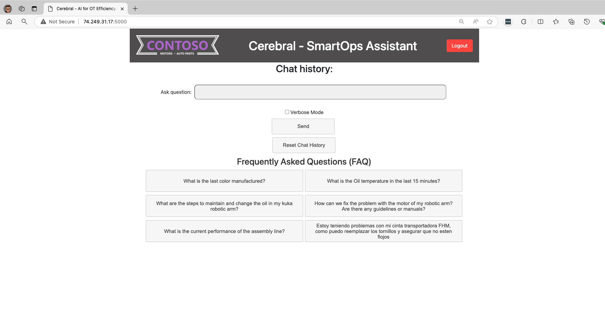

# Run the solution


## Access the data on the environment
The data is saved by the InfluxDB database on the Edge device. At the moment the port of InfluxDB is exposed. Open your web browser and navigate to the web address of your server appended with port 5000. For example ``` http://clusterip:8086 ``` where you can login to the InfluxDB with the follwowing credentials:<br> 
1. The username that you have created in step 1. <br>
2. The password is ``` QAIPassword123!! ```. Please change this after login. 

## Access the Education Copilot
Open your web browser and navigate to the web address of your server appended with port 5000. For example ```http://clusterip:5000 ```
<br>
Here you can login to the Copilot with the following credentials:<br>
1. The username is ``` Agastya ```
2. The password is ``` QAIPassword123!! ```

After logging in, you will be directed to the main interface where you can begin interacting with the system. You can start by typing a query related to the operational data or documentation in the provided text field.

### Interaction Tools:

* Text Input Box: Allows users to type in their questions or concerns.
* Verbose Mode Checkbox: Users can toggle this to receive more detailed in the response generation and see the data flow.
* Send Button: Sends the current query to the system for processing.
* Reset Chat History Button: Clears the session history, allowing users to start afresh without previous interactions.

Enter your question in the text box or choose a common question from the FAQ list displayed on the page. Hit the "Submit" button to see the copilot in action.



The system will process your query using QdxEdu AI, and the response, whether it be data visualizations or text information, will be displayed on the same page. This allows you to assess the accuracy and relevance of the response to your query.